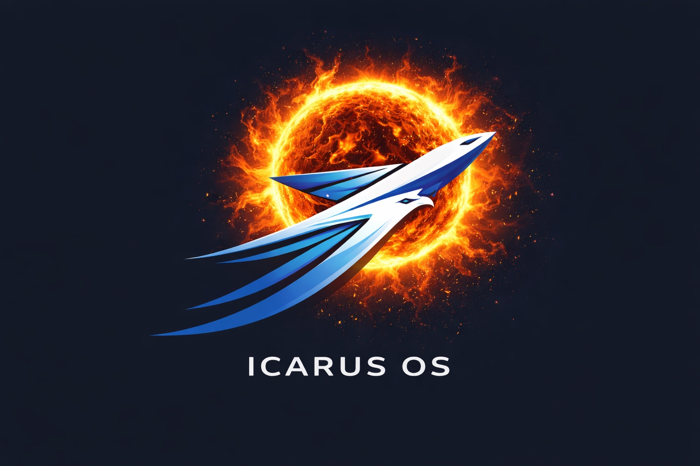

<p align="center">
  
</p>

# ICARUS OS Core

**Intelligent Certifiable Autonomous Real-time Unified System**

[](https://ironhide23586.github.io/icarus-os-core/)
[](https://github.com/sponsors/ironhide23586)
[](https://buymeacoffee.com/souham)

A minimal, deterministic real-time kernel for Cortex-M designed to support DO-178C DAL C certification objectives. Built from the ground up with safety-critical aerospace and defense applications in mind.

```
┌──────────────────────────────────────────────────────────────┐
│   ██╗ ██████╗  █████╗ ██████╗ ██╗   ██╗ ██████╗              │
│   ██║██╔════╝ ██╔══██╗██╔══██╗██║   ██║██╔════╝              │
│   ██║██║      ███████║██████╔╝██║   ██║╚█████╗               │
│   ██║██║      ██╔══██║██╔══██╗██║   ██║ ╚═══██╗              │
│   ██║╚██████╗ ██║  ██║██║  ██║╚██████╔╝██████╔╝              │
│   ╚═╝ ╚═════╝ ╚═╝  ╚═╝╚═╝  ╚═╝ ╚═════╝ ╚═════╝               │
│   Preemptive Kernel • ARMv7E-M • STM32H750                   │
└──────────────────────────────────────────────────────────────┘
```

> **⚠️ WARNING: This is work in progress and NOT production ready.**
> 
> This kernel is under active development. It may contain bugs, incomplete features, and is not suitable for use in production systems. Use at your own risk.

---

## Highlights

| Metric | Status |
|--------|--------|
| **Test Coverage** | 91.1% line, 89.5% function (host, see `tests/`) |
| **Unit Tests** | 140 Unity tests — run `cd tests && make test` |
| **Static Analysis** | cppcheck clean |
| **Certification Target** | DO-178C DAL C |
| **Coding Standard** | MISRA C:2012 subset |

---

## Terminal GUI — ICARUS Runner (Default)

The default firmware boots straight into **ICARUS Runner**, a Chrome-dino-style endless runner that demonstrates multitasking, IPC, and real-time rendering on the RTOS.

Connect via USB CDC at 115200 baud (see [Connecting to the Terminal](#connecting-to-the-terminal) below) and you'll see an 80×24 ANSI terminal game.

### Game Screen

```
ICARUS RUNNER          HI: 00350    SCORE: 00120
DEBUG: y=0x41880000 vel=0x00000000 grnd=1

              Player Grounded


                                                            XX
                                          XXX               XX
               ###                        XXX               XX
               ###                        XXX               XX
               ###
================================================================================


   Press K1 to jump!

```

The player (`###`) runs left-to-right on the ground line; obstacles (`X` blocks) scroll in from the right. Jump with K1 to dodge them.

- **4 concurrent RTOS tasks**: Input (10 ms), Physics (20 ms), Logic (50 ms), Render (50 ms)
- **IPC in action**: Semaphore-protected shared game state, pipe-based command passing between tasks
- **Dynamic difficulty**: Speed ramps from 1.0× to 4.0× as your score grows
- **High score persistence**: Stored in an RTC backup register — survives power cycles
- **Button control**: K1 (PC13) to jump, 50 ms debounce

### Enabling the IPC Dashboard / Stress Tests

The game is just one of four demo modes selected by compile-time flags near the top of `Core/Src/main.c`:

```c
#define ENABLE_GAME         1   // ← on by default
#define ENABLE_DEMO_TASKS   0   // 12 producer/consumer IPC tasks
#define ENABLE_STRESS_TEST  0   // 19-task high-contention suite
#define ENABLE_INTERACTIVE  0   // Button-controlled LED demo
```

To see the full IPC dashboard with progress bars, semaphore gauges, pipe history panels, and stress-test statistics, set the flags you want to `1`, rebuild (`bash build/rebuild.sh`), and reflash. Multiple modes can be enabled at once.

### IPC Dashboard Layout (when ENABLE_DEMO_TASKS / ENABLE_STRESS_TEST = 1)

```
┌──────────────────────────────────────────────────────────────────────────────────────────────────────────┐
│                                              HEADER                                                       │
│  ICARUS ASCII art logo + version info                                                                    │
├──────────────────────────────────────────────────────────────────────────────────────────────────────────┤
│                                         DEMO TASKS SECTION                                                │
│                                                                                                           │
│  [heartbeat]  ★★★★★★★★★★★★★★★★★★★★ [heartbeat]          SEM     +---SS---+  +---SM---+                   │
│  [producer]   ████████████────────  160/200 ticks       +---+   |>P0: 42|  |>P0:0042|                    │
│  [consumer]   ██████████──────────  100/190 ticks       |###|   |<C0: 42|  |<C0:0042|                    │
│  [reference]  ████████████████────  1200/3000 ticks     |###|   |>P0: 43|  |<C1:0043|                    │
│  [ss_prod]    ██████████████──────  220/400  →[106]     |###|   |<C0: 43|  |>P0:0044|                    │
│  [ss_cons]    ████████████────────  200/350  ←[105]     |   |   +--------+  +--------+                   │
│  [sm_prod]    ████████────────────   90/150  →[ 68]     |   |                                            │
│  [sm_con1]    ██████████████──────  225/350  ←[ 66]     +---+   +---MS---+  +---MM---+                   │
│  [sm_con2]    ████████████████────  300/450  ←[ 67]      3/10   |>P0: 42|  |>P0:006B|                    │
│  [ms_prd1]    ████████████████────  200/400  →[ 42]             |>P1:115|  |<C0:006B|                    │
│  [ms_prd2]    ██████████████████──  390/550  →[115]             |<C0: 42|  |>P1:0048|                    │
│  [ms_cons]    ████████────────────  150/350  ←[114]             |<C0:115|  |<C1:0048|                    │
│  [mm_prd1]    ██████████────────    175/400  →[ 23]             +--------+  +--------+                   │
│  [mm_prd2]    ████████████████████  480/600  →[ 11]                                                      │
│  [mm_con1]    ████████████████────  250/350  ←[ 22]                                                      │
│  [mm_con2]    ██████████████──────  280/400  ←[ 10]                                                      │
├──────────────────────────────────────────────────────────────────────────────────────────────────────────┤
│                                       STRESS TEST SECTION                                                 │
│                                                                                                           │
│  ═══════════════════════════════════════════════════════════════════════════════                         │
│    ⚡ STRESS TEST ACTIVE ⚡  Semaphores: 4  Pipes: 4  Tasks: 19                                           │
│  ═══════════════════════════════════════════════════════════════════════════════                         │
│                                                                                                           │
│  [sem_ham0]   ████████████████████   20/20  →[ 75]      SEM    SEM    SEM    SEM                         │
│  [sem_ham1]   ██████████████──────   14/20  ←[ 74]     +---+  +---+  +---+  +---+                        │
│  [sem_med0]   ████████████────────   60/100            |###|  |###|  |   |  |###|                        │
│  [sem_med1]   ██████████──────────   50/107            |###|  |###|  |   |  +---+                        │
│  [sem_slow]   ████████████████────   80/100            |###|  |   |  |   |   1/1                         │
│  [sem_mtx0]   ████████────────────   40/50  →[ 49]     |   |  |   |  |   |                               │
│  [sem_mtx1]   ██████████████──────   70/50  ←[ 48]     +---+  +---+  +---+                               │
│  [pf_send]    ████████████████████   10/10  →[255]      5/5    3/5    2/5                                │
│  [pf_recv]    ██████████████──────   14/20  ←[254]                                                       │
│  [pm_prd0]    ████████████────────   30/50  →[ 42]                                                       │
│  [pm_prd1]    ██████████████──────   35/61  →[ 41]                                                       │
│  [pm_prd2]    ████████████████────   40/73  →[ 40]                                                       │
│  [pm_cons]    ████████────────────   20/16  ←[ 39]                                                       │
│  [pv_send]    ██████████████████──   45/50  →[ 12]                                                       │
│  [pv_recv]    ████████████████────   40/55  ←[ 11]                                                       │
│  [yielder]    ████████████────────   12/20                                                               │
│  [sleeper]    ██████████──────────   25/50                                                               │
│  [cpu_hog]    ████████████████────   35/50                                                               │
│                                                                                                           │
│  STRESS: sem_f=1542 sem_c=1538 pipe_s=892 pipe_r=887 yields=4521 sleeps=3892                             │
│  WAITS: sem_max=45 pipe_max=12 full=234 empty=156                                                        │
│  VERIFY: seq=0 data=0 overflow=0 underflow=0  [PASS]                                                     │
└──────────────────────────────────────────────────────────────────────────────────────────────────────────┘
```

### Dashboard Components Explained

#### 1. Header Section
The ICARUS ASCII art logo with platform information (ARMv7E-M, STM32H750).

#### 2. Heartbeat Banner
```
[>ICARUS_HEARTBEAT<] ★★★★★★★★★★★★★★★★★★★★ [>ICARUS_HEARTBEAT<]
```
Flashes on/off synchronized with the onboard LED. Indicates the kernel is alive and scheduling tasks.

#### 3. Task Progress Bars
```
[task_name] ████████████────────────────  elapsed/period ticks
```
- **Green bars** (`████`): Producers sending messages
- **Magenta bars** (`████`): Consumers receiving messages
- **White bars**: Reference/utility tasks
- **Elapsed/Period**: Current tick count vs total period duration
- **Arrow indicators**: `→[value]` for sent messages, `←[value]` for received

#### 4. Semaphore Vertical Bars
```
  SEM
+---+
|###|  ← Filled portion (current count)
|###|
|   |  ← Empty portion
|   |
+---+
 3/10  ← current/max count
```
Visual representation of semaphore fill level. Fills from bottom to top as count increases.

#### 5. Message History Panels
```
+---SS---+
|>P0: 42|  ← Producer 0 sent value 42
|<C0: 42|  ← Consumer 0 received value 42
|>P0: 43|
|<C0: 43|
+--------+
```
Rolling history of the last 8 messages for each pipe configuration:
- **SS**: Single Producer → Single Consumer
- **SM**: Single Producer → Multiple Consumers
- **MS**: Multiple Producers → Single Consumer
- **MM**: Multiple Producers → Multiple Consumers

Format: `>Pn:` = Producer n sent, `<Cn:` = Consumer n received

#### 6. Stress Test Statistics

**STRESS line** - Operation counts:
| Metric | Description |
|--------|-------------|
| `sem_f` | Total semaphore feed (signal) operations |
| `sem_c` | Total semaphore consume (wait) operations |
| `pipe_s` | Total messages sent to pipes |
| `pipe_r` | Total messages received from pipes |
| `yields` | Times tasks voluntarily yielded CPU |
| `sleeps` | Times tasks called active sleep |

**WAITS line** - Contention metrics:
| Metric | Description |
|--------|-------------|
| `sem_max` | Longest wait time (ticks) for any semaphore operation |
| `pipe_max` | Longest wait time (ticks) for any pipe operation |
| `full` | Count of times sender blocked on full pipe |
| `empty` | Count of times receiver blocked on empty pipe |

**VERIFY line** - Data integrity verification:
| Metric | Description |
|--------|-------------|
| `seq` | Out-of-order message errors (FIFO violation) |
| `data` | Data corruption detected (wrong content) |
| `overflow` | Semaphore/pipe overflow errors |
| `underflow` | Semaphore/pipe underflow errors |
| `[PASS]` | Green if all zeros - no errors detected |
| `[FAIL]` | Red if any errors - bugs detected |

### Dashboard Color Coding

| Color | Meaning |
|-------|---------|
| **Green** | Producers, successful operations, PASS status |
| **Magenta** | Consumers, receive operations |
| **Cyan** | Headers, labels, informational |
| **Yellow** | Warnings, stress test header |
| **Red** | Errors, FAIL status |
| **White** | Normal text, reference tasks |

---

## Quick Start

### Prerequisites

- **ARM GCC Toolchain**: arm-none-eabi-gcc 13.3+ or 14.3+
- **Build Tools**: make, bash
- **Hardware**: STM32H750VBT6 development board
- **Debugger**: ST-Link or compatible
- **Terminal**: Any serial terminal (screen, minicom, PuTTY) or USB CDC viewer

### Building the Firmware

The project uses a unified build script that handles both firmware compilation and test execution:

```bash
# Clean build (recommended)
bash build/rebuild.sh

# Incremental build
bash build/build.sh

# Build output location
ls build/icarus_os.elf
ls build/icarus_os.hex
ls build/icarus_os.map
```

**Build artifacts (typical sizes, varies with options):**
- `icarus_os.elf` - ELF with debug symbols (on the order of ~100 KB for a clean `-O2` build in this tree)
- `icarus_os.hex` - Flash programming file (on the order of ~130–140 KB)
- `icarus_os.map` - Memory map and symbol table

### Memory Layout

ICARUS OS uses optimized memory placement for maximum performance and security:

```
┌─────────────────────────────────────────┐
│ ITCM (0x00000000) - 64 KB               │
│   Critical kernel code (zero wait)      │
│   - Context switch (PendSV_Handler)     │
│   - Scheduler (os_yield)                │
│   - IPC (semaphores, pipes)             │
│   - SVC dispatcher                      │
│   Protection: Read-only for all (MPU)   │
│   Used: 7.5 KB (12%) | Free: 56.5 KB    │
├─────────────────────────────────────────┤
│ DTCM (0x20000000) - 128 KB              │
│   Fast data access (zero wait)          │
│   - Kernel data structures              │
│   - Task lists, semaphores, pipes       │
│   - Tick counter, scheduler state       │
│   Protection: Privileged-only (MPU)     │
│   Used: 8 KB (6%) | Free: 120 KB        │
├─────────────────────────────────────────┤
│ RAM_D1 (0x24000000) - 512 KB            │
│   Task stacks and shared buffers        │
│   - 128 task stacks (256 words each)    │
│   - Display buffers                     │
│   Protection: Full access               │
│   Used: 128 KB (25%) | Free: 384 KB     │
├─────────────────────────────────────────┤
│ RAM_D2 (0x30000000) - 288 KB            │
│   Task data regions (2KB-aligned)       │
│   - Per-task isolated 2KB regions       │
│   Protection: Dynamic MPU (Region 4)    │
│   Used: 256 KB (89%) | Free: 32 KB      │
├─────────────────────────────────────────┤
│ Flash (0x08000000) - 128 KB             │
│   Program code and constants            │
│   Protection: Read-only (MPU)           │
│   Used: ~50 KB (39%)                    │
├─────────────────────────────────────────┤
│ QSPI (0x90000000) - 8 MB                │
│   External flash (future use)           │
│   Protection: Read-only (MPU)           │
└─────────────────────────────────────────┘
```

**MPU Region Configuration:**

| Region | Base | Size | Access | Purpose |
|--------|------|------|--------|---------|
| 0 | 0x00000000 | 64KB | Priv+User RO+Exec | ITCM code protection |
| 1 | 0x90000000 | 8MB | Priv+User RO+Exec | QSPI Flash |
| 2 | 0x08000000 | 128KB | Priv+User RO+Exec | Internal Flash |
| 3 | DISABLED | - | - | Reserved |
| 4 | Dynamic | 2KB | Priv+User RW | Task data isolation |
| 5 | 0x20000000 | 128KB | Priv RW only | DTCM kernel data |
| 6 | 0x24000000 | 512KB | Full Access | RAM_D1 stacks |
| 7 | 0x40000000 | 512MB | Full Access | Peripherals |

### Flashing the Firmware

**Using ST-Link:**
```bash
# Flash the hex file
st-flash --format ihex write build/icarus_os.hex

# Or flash the binary
st-flash write build/icarus_os.bin 0x08000000
```

**Using OpenOCD:**
```bash
openocd -f interface/stlink.cfg -f target/stm32h7x.cfg \
  -c "program build/icarus_os.elf verify reset exit"
```

**Using STM32CubeProgrammer:**
```bash
STM32_Programmer_CLI -c port=SWD -w build/icarus_os.hex -v -rst
```

### Connecting to the Terminal

ICARUS OS outputs to USB CDC (Virtual COM Port). Connect using any serial terminal:

**Using screen (macOS/Linux):**
```bash
# Find the device
ls /dev/tty.usbmodem*  # macOS
ls /dev/ttyACM*        # Linux

# Connect (115200 baud, 8N1)
screen /dev/tty.usbmodem14203 115200

# Exit: Ctrl+A, then K, then Y
```

**Using minicom (Linux):**
```bash
# Configure once
sudo minicom -s
# Set: Serial Device = /dev/ttyACM0, Baud = 115200

# Connect
sudo minicom
```

**Using PuTTY (Windows):**
1. Open PuTTY
2. Connection type: Serial
3. Serial line: COM3 (check Device Manager)
4. Speed: 115200
5. Click "Open"

**Using the provided script (macOS):**
```bash
# Auto-detect and connect
bash icarus_terminal.sh
```

### What You'll See

Out of the box you get the **ICARUS Runner** game — an 80×24 ANSI endless-runner rendered in real time by 4 cooperating RTOS tasks. Press **K1** to jump.

To switch to the IPC dashboard / stress-test view, flip the compile-time flags described in the [Terminal GUI](#terminal-gui--icarus-runner-default) section, rebuild, and reflash.

---

## Overview

ICARUS OS is a lightweight, preemptive real-time operating system kernel designed for ARM Cortex-M7 microcontrollers (specifically STM32H750VBT6). The kernel provides deterministic task scheduling, hardware-enforced memory protection, and a comprehensive API for safety-critical embedded applications.

### Vision

ICARUS is designed to be the first open-source RTOS with:
- **Native AI integration** with certifiable determinism (planned)
- **DO-178C alignment by design** (not retrofitted)
- **Hardware-agnostic portability** across safety-critical platforms
- **Formal verification readiness** for DAL A applications (future)

### Key Features

#### Core Kernel
- **Preemptive Round-Robin Scheduling**: Time-sliced task execution with configurable time quantum (50ms default)
- **Deterministic Context Switching**: Assembly-optimized context save/restore using PendSV with MPU reconfiguration
- **Task State Management**: Full lifecycle support (COLD, READY, RUNNING, BLOCKED, KILLED, FINISHED)
- **Bounded Semaphores**: Counting semaphores with blocking feed/consume for producer-consumer patterns
- **Message Queues (Pipes)**: FIFO byte-stream IPC with blocking enqueue/dequeue, supports multi-byte messages up to 128 bytes
- **Active Sleep**: Cooperative sleep that allows other tasks to run
- **Blocking Sleep**: Busy-wait sleep for critical timing
- **Up to 128 Tasks**: Configurable task pool with 2KB stack and 2KB data region per task
- **64 Semaphores & 64 Pipes**: Rich IPC primitives for complex applications

#### Memory Protection (v0.1.0)
- **Hardware-Enforced Isolation**: ARM Cortex-M7 MPU with 8-region configuration
- **DTCM Protection**: Kernel data isolated in privileged-only memory (Region 5, 128KB)
- **ITCM Protection**: Kernel code marked read-only to prevent modification attacks (Region 0, 64KB)
- **Task Data Isolation**: Each task gets isolated 2KB data region with MPU reconfiguration on context switch (Region 4)
- **Privilege Separation**: Tasks run unprivileged (CONTROL.nPRIV=1), kernel runs privileged via SVC mechanism
- **40 SVC Call Gates**: Controlled privilege transitions with atomic kernel state access
- **Fault Recovery**: Graceful handling of MemManage faults with fault address/PC capture and LED blink decoder
- **Attack Validation**: 5 red team test tasks validate 100% protection effectiveness

#### ICARUS Runner Game
- **Multi-Task Demo**: Chrome dino-style endless runner showcasing RTOS capabilities
- **4 Concurrent Tasks**: Input (10ms), Physics (20ms), Logic (50ms), Render (50ms)
- **IPC Demonstration**: Semaphore-protected shared state, pipe-based command passing
- **Dynamic Difficulty**: Speed increases with score (1.0x-4.0x multiplier based on distance)
- **High Score Persistence**: RTC backup register storage survives power cycles
- **80×24 Terminal Display**: ANSI escape code rendering with collision detection
- **Button Control**: K1 button (PC13) for jump input with 50ms debouncing

#### Demo & Testing
- **Demo Tasks**: 12 producer/consumer tasks demonstrating semaphores and pipes (SS, SM, MS, MM patterns)
- **Stress Testing**: 19 competing tasks with high-contention IPC operations (10+ min stability verified)
- **Interactive Demo**: Button-controlled LED with real-time feedback
- **Visual Debugging**: Terminal-based GUI with progress bars, message history, semaphore/pipe visualization
- **USB CDC Support**: Serial communication via USB Virtual COM Port (115200 baud)

#### Development & Quality
- **MISRA C Compliant**: Follows MISRA C:2012 coding standards
- **Comprehensive Unit Tests**: 140+ Unity tests; run `cd tests && make coverage-summary` for current line/function coverage on the host build
- **Static Analysis**: cppcheck clean, zero warnings
- **Standalone Build System**: Makefile-based build without IDE dependency
- **Memory Map Visualizer**: Interactive web tool for analyzing linker output
- **DO-178C Documentation**: Complete certification-aligned documentation suite

---

## Architecture Overview

ICARUS OS is structured in layers, from low-level hardware abstraction to high-level application tasks.

### System Architecture

```
┌─────────────────────────────────────────────────────────────┐
│                    APPLICATION LAYER                         │
│  ┌──────────────┐  ┌──────────────┐  ┌──────────────┐      │
│  │ ICARUS Runner│  │  Demo Tasks  │  │ Stress Tests │      │
│  │   (Game)     │  │ (Producers/  │  │ (19 tasks)   │      │
│  │  4 tasks     │  │  Consumers)  │  │              │      │
│  └──────────────┘  └──────────────┘  └──────────────┘      │
├─────────────────────────────────────────────────────────────┤
│                      ICARUS RTOS API                         │
│  ┌──────────────┐  ┌──────────────┐  ┌──────────────┐      │
│  │  Semaphores  │  │    Pipes     │  │    Tasks     │      │
│  │  (64 max)    │  │  (64 max)    │  │  (128 max)   │      │
│  └──────────────┘  └──────────────┘  └──────────────┘      │
├─────────────────────────────────────────────────────────────┤
│                      KERNEL LAYER                            │
│  ┌──────────────┐  ┌──────────────┐  ┌──────────────┐      │
│  │  Scheduler   │  │ Context      │  │  SVC Handler │      │
│  │ (Round-Robin)│  │ Switch (ASM) │  │  (40 gates)  │      │
│  └──────────────┘  └──────────────┘  └──────────────┘      │
│  ┌──────────────┐  ┌──────────────┐  ┌──────────────┐      │
│  │ Task Manager │  │ IPC Manager  │  │ MPU Manager  │      │
│  └──────────────┘  └──────────────┘  └──────────────┘      │
├─────────────────────────────────────────────────────────────┤
│                   BOARD SUPPORT PACKAGE                      │
│  ┌──────────────┐  ┌──────────────┐  ┌──────────────┐      │
│  │   Display    │  │   USB CDC    │  │     RTC      │      │
│  │  (Terminal)  │  │  (Serial)    │  │ (Persistence)│      │
│  └──────────────┘  └──────────────┘  └──────────────┘      │
│  ┌──────────────┐  ┌──────────────┐  ┌──────────────┐      │
│  │   GPIO/LED   │  │   SPI/I2C    │  │    Timer     │      │
│  └──────────────┘  └──────────────┘  └──────────────┘      │
├─────────────────────────────────────────────────────────────┤
│                    HARDWARE LAYER                            │
│  STM32H750VBT6 (ARM Cortex-M7 @ 480MHz)                     │
│  128KB Flash | 1MB RAM | 64KB ITCM | 128KB DTCM             │
└─────────────────────────────────────────────────────────────┘
```

### Directory Structure

```
icarus-os-core/
├── Core/
│   ├── Inc/
│   │   ├── icarus/          # RTOS kernel headers
│   │   │   ├── icarus.h     # Main API umbrella header
│   │   │   ├── kernel.h     # Kernel state and initialization
│   │   │   ├── scheduler.h  # Task scheduling
│   │   │   ├── task.h       # Task management
│   │   │   ├── semaphore.h  # Semaphore API
│   │   │   ├── pipe.h       # Message pipe API
│   │   │   ├── svc.h        # SVC definitions (40 call gates)
│   │   │   ├── types.h      # Core data structures (TCB, etc.)
│   │   │   └── config.h     # Configuration constants
│   │   ├── bsp/             # Board support package headers
│   │   │   ├── bsp.h        # BSP master header
│   │   │   ├── config.h     # Hardware pin mappings
│   │   │   ├── display.h    # Terminal GUI
│   │   │   ├── gpio.h       # GPIO/LED control
│   │   │   ├── i2c.h        # I2C driver (IMU)
│   │   │   ├── spi.h        # SPI driver (LCD)
│   │   │   ├── rtc.h        # Real-time clock
│   │   │   ├── timer.h      # Timer/PWM
│   │   │   └── usb.h        # USB CDC
│   │   ├── game/            # ICARUS Runner game headers
│   │   │   ├── game.h       # Game API
│   │   │   ├── game_config.h # Game constants
│   │   │   ├── game_types.h  # Game data structures
│   │   │   └── game_internal.h # Internal game state
│   │   ├── demo_tasks.h     # Demo task registration
│   │   ├── interactive_tasks.h # Interactive demo
│   │   ├── stress_test.h    # Stress test suite
│   │   └── main.h           # Main entry point
│   ├── Src/
│   │   ├── icarus/          # RTOS kernel implementation
│   │   │   ├── kernel.c     # Kernel core
│   │   │   ├── scheduler.c  # Scheduler logic
│   │   │   ├── task.c       # Task management
│   │   │   ├── semaphore.c  # Semaphore implementation
│   │   │   ├── pipe.c       # Pipe implementation
│   │   │   ├── svc.c        # SVC dispatcher
│   │   │   └── context_switch.s # Assembly context switch
│   │   ├── bsp/             # BSP implementation
│   │   ├── game/            # Game implementation
│   │   │   ├── game.c       # Game initialization
│   │   │   ├── game_state.c # State management
│   │   │   ├── game_physics.c # Physics engine
│   │   │   ├── game_collision.c # Collision detection
│   │   │   ├── game_render.c # Terminal rendering
│   │   │   ├── game_obstacles.c # Obstacle management
│   │   │   └── game_score.c # Score tracking
│   │   ├── demo_tasks.c     # Demo task implementation
│   │   ├── interactive_tasks.c # Interactive demo
│   │   ├── stress_test.c    # Stress test implementation
│   │   └── main.c           # Application entry point
│   └── Startup/
│       └── startup_stm32h750vbtx.s # Startup code
├── Drivers/
│   ├── STM32H7xx_HAL_Driver/ # STM32 HAL library
│   ├── CMSIS/               # ARM CMSIS headers
│   └── BSP/ST7735/          # LCD driver
├── Middlewares/
│   └── ST/STM32_USB_Device_Library/ # USB device stack
├── USB_DEVICE/              # USB CDC application
├── build/
│   ├── Makefile             # Standalone build system
│   ├── rebuild.sh           # Clean rebuild script
│   └── build.sh             # Incremental build script
├── tests/
│   ├── src/                 # Unit test sources
│   ├── mocks/               # Hardware mocks
│   ├── unity/               # Unity test framework
│   ├── cmock/               # CMock framework
│   ├── Makefile             # Test build system
│   └── README.md            # Test documentation
├── docs/
│   ├── do178c/              # DO-178C certification docs
│   │   ├── plans/           # PSAC, SDP, SVP, SCMP, SQAP
│   │   ├── requirements/    # SRS (71 requirements)
│   │   ├── design/          # SDD with traceability
│   │   ├── verification/    # Coverage, test traceability
│   │   └── README.md        # Documentation overview
│   └── doxygen/             # API documentation
├── tools/
│   └── map-visualizer/      # Memory map visualization tool
│       ├── index.html       # Web interface
│       ├── app.js           # Application controller
│       ├── parser.js        # Map file parser
│       ├── visualizer.js    # Memory layout renderer
│       └── README.md        # Tool documentation
├── STM32H750VBTX_FLASH.ld   # Linker script (Flash boot)
├── STM32H750VBTX_RAM.ld     # Linker script (RAM boot)
├── icarus_terminal.sh       # Terminal connection script
├── FAULT_BLINK_DECODER.md   # LED fault decoder guide
├── README.md                # This file
└── LICENSE                  # Apache 2.0 license
```

### Task Execution Flow

```
1. System Boot
   ├─> Reset_Handler (startup_stm32h750vbtx.s)
   ├─> SystemInit() - Configure clocks, MPU, caches
   ├─> main()
   │   ├─> hal_init() - Initialize BSP
   │   ├─> os_init() - Initialize kernel
   │   ├─> game_init() / demo_tasks_init() - Register tasks
   │   └─> os_start() - Start scheduler (never returns)
   │
2. Scheduler Loop (in SysTick_Handler)
   ├─> Decrement current_task_ticks_remaining
   ├─> If time slice expired:
   │   └─> Trigger PendSV (context switch)
   │
3. Context Switch (PendSV_Handler)
   ├─> Save current task context (R4-R11, PSP)
   ├─> Update current task state (RUNNING → READY)
   ├─> Select next ready task (round-robin)
   ├─> Reconfigure MPU Region 4 for task data
   ├─> Restore next task context
   └─> Return to task (unprivileged mode)
   │
4. Task Execution
   ├─> Task runs in unprivileged mode
   ├─> Can call RTOS API via SVC instructions
   ├─> Can access own stack (RAM_D1) and data (RAM_D2)
   ├─> Cannot access kernel data (DTCM) or other tasks' data
   └─> Preempted after 50ms time slice
```

### IPC Data Flow Example (Semaphore)

```
Producer Task                    Kernel (DTCM)              Consumer Task
─────────────                    ─────────────              ─────────────
                                                            
semaphore_feed(0)                                           semaphore_consume(0)
    │                                                           │
    ├─> while (!sem_can_feed(0))  ──SVC 29──>                 ├─> while (!sem_can_consume(0))
    │       task_active_sleep(1)              Check count     │       task_active_sleep(1)
    │                             <──Return──  < max?         │
    │                                                          │
    ├─> sem_increment(0)          ──SVC 33──>                 │
    │                                         ++count         │
    │                             <──Return──                 │
    │                                                          │
    │                                                          ├─> sem_decrement(0)  ──SVC 34──>
    │                                                          │                                --count
    │                                                          │                    <──Return──
    │                                                          │
    └─> Continue                                               └─> Continue
```

---

## Memory Protection Architecture

ICARUS OS implements comprehensive hardware-enforced memory protection using the ARM Cortex-M7 Memory Protection Unit (MPU). This provides three layers of isolation essential for safety-critical applications.

### Protection Layers

#### 1. DTCM Protection (Kernel Data Isolation)
**Problem:** Unprivileged tasks could corrupt kernel state (task lists, semaphores, pipes, tick counter).

**Solution:** Kernel data structures isolated in privileged-only DTCM (Region 5: PRIV_RW).

**Implementation:**
- All kernel data marked with `DTCM_DATA_PRIV` attribute
- Unprivileged tasks cannot directly read/write DTCM
- All kernel data access forced through SVC call gates

**Verification:** `mpu_dtcm_attack_task` attempts DTCM read → MemManage fault (protection working)

#### 2. ITCM Protection (Code Integrity)
**Problem:** Malicious code could modify kernel handlers at runtime.

**Solution:** Kernel code marked read-only in ITCM (Region 0: RO for all).

**Implementation:**
- All kernel code placed in ITCM section
- MPU Region 0 configured as read-only + executable
- Write attempts trigger MemManage fault

**Verification:** `mpu_itcm_write_test` attempts ITCM write → MemManage fault (protection working)

#### 3. Task Data Isolation (Cross-Task Protection)
**Problem:** One task could corrupt another task's data, causing cascading failures.

**Solution:** Each task gets isolated 2KB data region with MPU reconfiguration on context switch.

**Implementation:**
- Task data regions allocated from RAM_D2 (2KB-aligned)
- MPU Region 4 reconfigured in PendSV handler
- Memory barriers (DSB/ISB) ensure MPU changes take effect

**Verification:** `mpu_redteam_task` attempts cross-task access → MemManage fault (protection working)

### SVC Call Gate Architecture

**Challenge:** Once DTCM is privileged-only, spinning functions (semaphore feed/consume, pipe enqueue/dequeue) cannot read kernel state from unprivileged mode.

**Solution:** SVC call gates that read/write kernel state atomically in privileged mode.

**40 SVC Numbers Defined:**

| SVC Range | Purpose | Examples |
|-----------|---------|----------|
| 0-15 | Core kernel operations | os_init, os_start, os_yield, task_sleep |
| 16-28 | IPC operations | semaphore_init, pipe_init, task lifecycle |
| 29-36 | Call gates (spinning) | sem_can_feed, pipe_can_enqueue, sem_increment, pipe_write_bytes |
| 37-39 | Metadata gates | os_get_tick_count, os_get_task_name |

**Spinning Pattern with Call Gates:**
```c
bool semaphore_feed(uint8_t semaphore_idx) {
    while (!sem_can_feed(semaphore_idx)) {  // SVC 29: read DTCM
        task_active_sleep(1);
    }
    sem_increment(semaphore_idx);  // SVC 33: write DTCM
    return true;
}
```

### Fault Handling

**MemManage Handler Features:**
- Captures fault address (MMFAR register)
- Captures fault PC (exception stack frame)
- Fault counter with limit (1000 faults before halt)
- Instruction skip recovery (+2 bytes for Thumb-2)
- Fault blink pattern for debugging (2 rapid blinks)

**Fault Statistics (10 min stress test with attack tasks):**
- Total faults: 240 (all intentional from attack tests)
- Fault recovery: 100% successful
- System uptime: 100%

### Performance Impact

| Metric | Before MPU | After MPU | Overhead |
|--------|------------|-----------|----------|
| Context switch | ~8μs | ~10μs | +2μs (+25%) |
| SVC call | N/A | ~0.8μs | N/A |
| Code size | 32KB | 39.5KB | +7.5KB (+23%) |
| Data size | 512KB | 768KB | +256KB (+50%) |

**Note:** Context switch overhead is negligible for 50ms time quantum (0.004% overhead).

### Attack Test Results

| Test | Attack Type | Expected | Result |
|------|-------------|----------|--------|
| `mpu_dtcm_attack_task` | Read kernel data | MemManage fault | ✅ Fault caught |
| `mpu_itcm_write_test` | Modify kernel code | MemManage fault | ✅ Fault caught |
| `mpu_redteam_task` | Cross-task access | MemManage fault | ✅ Fault caught |
| `mpu_kernel_bypass_test` | Direct kernel call | MemManage fault | ✅ Fault caught |
| `mpu_verify_task` | Data integrity | No corruption | ✅ 0 errors |

**Protection Effectiveness:** 100% (all attacks caught, system stable)

---

## Tools & Utilities

### Memory Map Visualizer

ICARUS OS includes an interactive web-based tool for analyzing linker map files. This helps with debugging memory issues, optimizing Flash/RAM usage, and understanding the memory layout.

**Features:**
- Automatic loading of `build/icarus_os.map`
- Interactive memory region filtering
- Click-to-explore sections and symbols
- Real-time symbol search
- Visual memory layout with proportional sizing
- Color-coded sections (Flash, RAM, DTCM, ITCM, etc.)
- Detailed statistics and usage percentages

**Usage:**
```bash
# Open in browser
open tools/map-visualizer/index.html

# Or use a local server
cd tools/map-visualizer
python3 -m http.server 8000
# Then open http://localhost:8000
```

**Use Cases:**
- Debug stack overflow issues
- Identify large sections consuming Flash
- Find symbol addresses quickly
- Visualize memory region utilization
- Spot overlapping sections

See `tools/map-visualizer/README.md` for detailed documentation.

### Terminal Connection Script

The `icarus_terminal.sh` script automatically detects your STM32 board and connects to the USB serial port.

**Features:**
- Auto-detection of USB serial devices (macOS/Linux)
- Supports multiple terminal programs (picocom, screen)
- Automatic cursor restoration on exit
- Helpful error messages with device listing

**Usage:**
```bash
# Connect to ICARUS OS terminal
bash icarus_terminal.sh

# Exit:
# - picocom: Ctrl+A then Ctrl+X
# - screen: Ctrl+A then K
```

### Fault Blink Decoder

When a MemManage fault occurs, ICARUS OS blinks the LED to communicate the fault address. This is useful for debugging MPU violations.

**Blink Pattern:**
1. 4 fast blinks - MemManage fault indicator
2. Long pause (4 seconds)
3. Address nibbles - Upper 16 bits of MMFAR (4 hex digits)
4. Long pause (6 seconds)
5. Continuous 4 blinks - System halted

**Decoding:**
- 0 = One long blink (0.8s)
- 1-15 = That many short blinks (0.2s each)
- Between nibbles: 1 second pause

**Example:**
```
4 fast → pause → 2 blinks → pause → 0 (long) → pause → 0 (long) → pause → 0 (long)
Decodes to: 0x2000xxxx (DTCM region)
```

See `FAULT_BLINK_DECODER.md` for complete documentation.

---

## DO-178C Alignment

ICARUS OS is being developed to support DO-178C DAL C certification objectives. Complete certification-aligned documentation is available in `docs/do178c/`.

### Documentation Suite

| Category | Documents |
|----------|-----------|
| **Plans** | PSAC, SDP, SVP, SCMP, SQAP |
| **Requirements** | SRS (71 requirements: 41 implemented, 30 planned) |
| **Design** | SDD with full traceability matrix |
| **Verification** | Coverage analysis, deactivated code analysis, test traceability |

**Memory Protection Requirements (HLR-KRN-063 to HLR-KRN-086):**
- 14 new requirements for MPU-based isolation
- All requirements implemented and verified
- Attack tests validate 100% protection effectiveness

### Compliance Status

| Objective | Status |
|-----------|--------|
| Static analysis (cppcheck) | ✅ Complete |
| MISRA C:2012 subset | ✅ Complete |
| Unit testing (Unity) | ✅ 140 tests |
| Line coverage | ✅ ~91% (host `lcov`, kernel+BSP under test) |
| Function coverage | ✅ ~89.5% |
| Requirements traceability | ✅ SRS complete |
| Design traceability | ✅ SDD complete |
| MC/DC coverage | 🔄 In progress |
| PC-lint Plus (full MISRA) | 📋 Planned |
| Formal verification | 📋 Planned (DAL B) |

### Running Verification

```bash
# Run all tests
cd tests && make clean test

# Generate coverage report
cd tests && make COVERAGE=yes clean test coverage-html

# Run static analysis
cd build && make cppcheck
```

---

## Project Status & Roadmap

### Current Status (v0.1.0)

ICARUS OS is in active development with core functionality complete and undergoing verification.

**Implemented Features:**
- ✅ Preemptive round-robin scheduler with 50ms time quantum
- ✅ Hardware-enforced memory protection (MPU with 8 regions)
- ✅ Task management (128 tasks, 2KB stack + 2KB data each)
- ✅ Semaphores (64 max, counting with blocking operations)
- ✅ Message pipes (64 max, FIFO with up to 128-byte messages)
- ✅ SVC call gates (40 gates for privilege separation)
- ✅ Context switching with MPU reconfiguration
- ✅ Fault recovery with LED blink decoder
- ✅ Terminal GUI with real-time visualization
- ✅ USB CDC serial communication
- ✅ ICARUS Runner game demo (4 tasks)
- ✅ Demo tasks (12 producer/consumer patterns)
- ✅ Stress testing (19 tasks, 10+ min stability)
- ✅ Unit testing (140 tests; ~91% statement coverage on exercised kernel/BSP sources — see `tests/README.md`)
- ✅ Static analysis (cppcheck clean)
- ✅ MISRA C:2012 compliance
- ✅ DO-178C documentation (plans, requirements, design, verification)
- ✅ Memory map visualizer tool
- ✅ Standalone build system (Makefile)

**Known Limitations:**
- ⚠️ Priority-based scheduling not yet implemented (round-robin only)
- ⚠️ No dynamic memory allocation (static allocation only)
- ⚠️ Limited to STM32H750VBT6 (portability planned)
- ⚠️ MC/DC coverage analysis not yet complete
- ⚠️ Formal verification not yet started

### Roadmap

#### v0.2.0 (Q2 2026) - Priority Scheduling
- [ ] Priority-based preemptive scheduling
- [ ] Priority inheritance for semaphores
- [ ] Priority ceiling protocol
- [ ] Deadline-driven scheduling
- [ ] Enhanced stress tests for priority inversion

#### v0.3.0 (Q3 2026) - Enhanced IPC
- [ ] Event flags (binary semaphores with broadcast)
- [ ] Mutexes with priority inheritance
- [ ] Mailboxes (fixed-size message queues)
- [ ] Shared memory regions with access control
- [ ] IPC timeout mechanisms

#### v0.4.0 (Q4 2026) - Portability
- [ ] HAL abstraction layer
- [ ] Support for STM32F7 series
- [ ] Support for STM32H7 series (all variants)
- [ ] Support for other Cortex-M7 MCUs
- [ ] Board configuration system

#### v0.5.0 (Q1 2027) - Advanced Features
- [ ] Dynamic task creation/deletion
- [ ] Task suspension/resumption
- [ ] Software timers
- [ ] Watchdog integration
- [ ] Power management (sleep modes)

#### v1.0.0 (Q2 2027) - Certification Ready
- [ ] Complete MC/DC coverage analysis
- [ ] Full MISRA C:2012 compliance (PC-lint Plus)
- [ ] Formal verification (CBMC or similar)
- [ ] DO-178C DAL C certification package
- [ ] Production-ready release

#### v2.0.0 (2028+) - AI Integration
- [ ] Deterministic neural network inference
- [ ] Certifiable AI runtime
- [ ] Model quantization and optimization
- [ ] Safety monitors for AI outputs
- [ ] DO-178C DAL B certification for AI components

### Contributing

ICARUS OS is open source and welcomes contributions! Areas where help is needed:

**High Priority:**
- MC/DC coverage analysis and tooling
- Formal verification setup (CBMC, Frama-C)
- Porting to other STM32 variants
- Additional demo applications
- Documentation improvements

**Medium Priority:**
- Priority scheduling implementation
- Enhanced IPC primitives
- Power management features
- Additional unit tests
- Performance benchmarking

**Low Priority:**
- GUI improvements
- Additional visualization tools
- Example projects
- Tutorial content

**How to Contribute:**
1. Fork the repository
2. Create a feature branch (`git checkout -b feature/amazing-feature`)
3. Follow MISRA C:2012 coding standards
4. Add unit tests for new functionality
5. Update documentation
6. Submit a pull request

There is no separate `CONTRIBUTING.md` yet; use the checklist above when opening a pull request.

---

## Support ICARUS OS

Building a certifiable RTOS from scratch is a massive undertaking. ICARUS OS is developed in the open because safety-critical software should be transparent, auditable, and accessible to everyone building systems where failure is not an option.

Your sponsorship directly funds:
- 🔬 **Formal verification tooling** for DAL A/B certification paths
- 📋 **Full MISRA C:2012 compliance** with commercial static analyzers
- 🧪 **MC/DC coverage infrastructure** for complete decision coverage
- 📚 **Expanded platform support** beyond STM32H7
- ⚡ **Performance optimization** and determinism guarantees

If ICARUS OS helps your project, or you believe in open-source safety-critical software, consider supporting its development:

<p align="center">
  <a href="https://github.com/sponsors/ironhide23586">
    
  </a>
  &nbsp;&nbsp;
  <a href="https://buymeacoffee.com/souham">
    
  </a>
</p>

---
